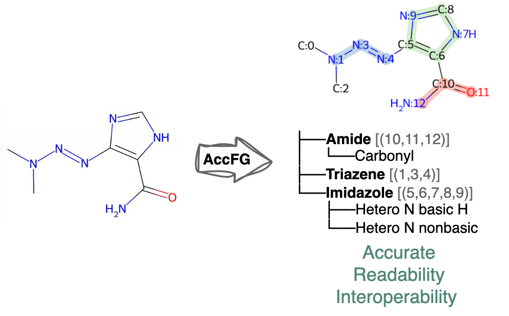
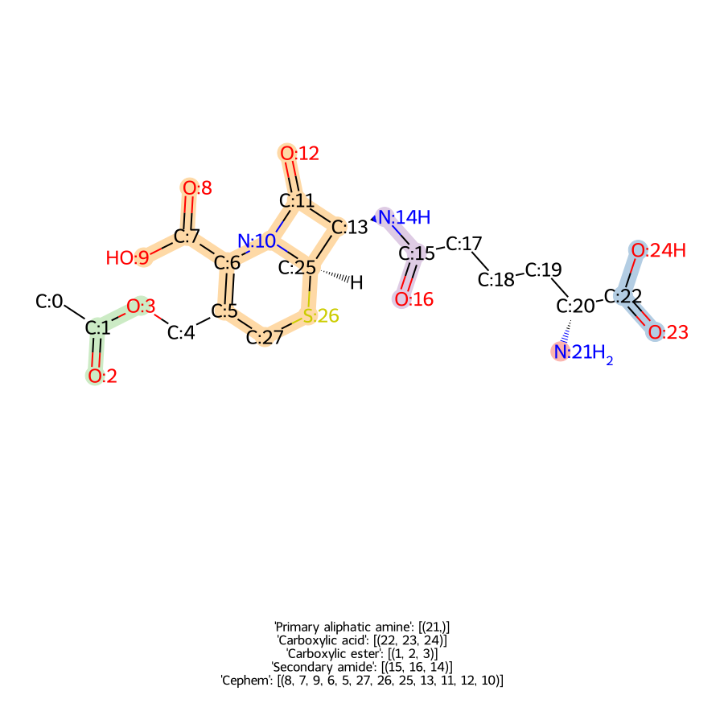
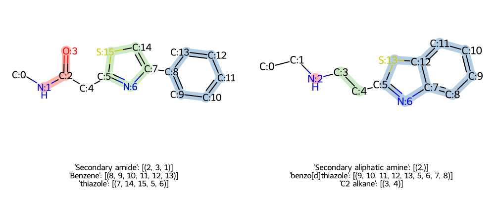

# AccFG: Accurate Functional Group Extraction and Molecular Structure Comparison

<div align="center">

[](https://pypi.org/project/accfg/0.0.4/)
[](https://pepy.tech/projects/accfg)
[](https://www.python.org/)
[](https://pubs.acs.org/doi/10.1021/acs.jcim.5c01317)
[](https://github.com/xuanliugit/AccFG)

</div>

## 🚀News
* AccFG v0.0.4: Update FG names with lowercase; Update 3 new FGs (chloroformate etc.)

* AccFG v0.0.3: 
    * update `AccFG.run_mol()` for directing processing rdkit `Mol` object
    * Lite version of AccFg is available through `AccFG(lite=True)`, this will load a simplified FG list (e.g., no primary/secondary hydroxyl but only hydroxyl)


## 📝Introduction

This is the official code repository for the paper [AccFG: Accurate Functional Group Extraction and Molecular Structure Comparison](https://pubs.acs.org/doi/10.1021/acs.jcim.5c01317). AccFG is a tool for precise functional group (FG) extraction and molecular structure comparison.



## 📥Installation

We provide two methods to install AccFG:

### Method 1: Installation by pip (recommended)

```bash
pip install accfg
```

### Method 2: Installation from GitHub repository

To install AccFG, follow these steps:

1. Clone/download the repository and navigate to the project directory:
    ```bash
    git clone https://github.com/xuanliugit/AccFG.git
    cd AccFG
    ```
2. Install the required dependencies:
    ```bash
    conda create --name accfg python=3.10
    conda activate accfg
    pip install -r requirements.txt
    ```
## ☎️Call for new functional groups 

The FG dictionary is stored in `./accfg/fgs_common.csv` and `./accfg/fgs_heterocycle.csv`. You are welcome to report new functional groups or errors in the current files by opening an issue on GitHub or emailing the author at xliu254@illinois.edu. Your contributions will be acknowledged on this page.

Note: The two `fgs*.csv` files are custom-formatted to be compatible with the `AccFG.csv_to_dict()` function in `./accfg/main.py`. Compared to standard CSV files, they include additional annotation syntax to support structured parsing. Lines that begin with `%` are treated as comments to enhance readability and are excluded during data import.

## ⚙️Usage

### Quick start:
```bash
# Get functional groups from SMILES
python run_accfg.py 'CN(C)/N=N/C1=C(NC=N1)C(=O)N'

# Compare two molecules
python run_accfg.py 'CNC(=O)Cc1nc(-c2ccccc2)cs1' --compare_smi 'CCNCCc1nc2ccccc2s1'
```

### FG extraction

To extract functional groups:
```python
# example.py
from accfg import AccFG

afg = AccFG(print_load_info=True)
smi = 'CN(C)/N=N/C1=C(NC=N1)C(=O)N'

fgs,fg_graph = afg.run(smi, show_atoms=True, show_graph=True)

print_fg_tree(fg_graph, fgs.keys(), show_atom_idx=True)
'''
├──Primary amide: ((10, 12, 11),)
...
'''
print(fgs)
'''
{'Primary amide': [(10, 12, 11)], 'Triazene': [(1, 3, 4)], 'imidazole': [(5, 9, 8, 7, 6)]}
'''

```

User-defined FGs Example:
```python
# example.py
from accfg import AccFG

my_fgs_dict = {'Cephem': 'O=C(O)C1=CCS[C@@H]2CC(=O)N12', 'Thioguanine': 'Nc1nc(=S)c2[nH]cnc2[nH]1'}
my_afg = AccFG(user_defined_fgs=my_fgs_dict,print_load_info=True)

cephalosporin_C = 'CC(=O)OCC1=C(N2[C@@H]([C@@H](C2=O)NC(=O)CCC[C@H](C(=O)O)N)SC1)C(=O)O'
fgs,fg_graph = my_afg.run(cephalosporin_C, show_atoms=True, show_graph=True)

print_fg_tree(fg_graph, fgs.keys(), show_atom_idx=True) # This will print the FG tree

'''
├──Primary aliphatic amine: ((21,),)
├──...
'''
```
To print functional groups:
```python
print(fgs) # Show top level FGs
'''
{'Primary aliphatic amine': [(21,)],
 'Carboxylic acid': [(22, 23, 24)],
 'Carboxylic ester': [(1, 2, 3, 4)],
 'Secondary amide': [(15, 16, 14, 13)],
 'Cephem': [(8, 7, 9, 6, 5, 27, 26, 25, 13, 11, 12, 10)]}
'''
```

### FG extraction visualization

```python
from accfg import draw_mol_with_fgs, molimg

molimg(draw_mol_with_fgs(cephalosporin_C, afg=my_afg, img_size=(900,900)))
```

This will show image with FGs highlighted



### Molecular structure comparison
```python
from accfg import AccFG, compare_mols, draw_compare_mols

smi_1,smi_2 = ('CNC(=O)Cc1nc(-c2ccccc2)cs1','CCNCCc1nc2ccccc2s1')
diff = compare_mols(smi_1, smi_2)
print(diff) # This print the structure difference
'''
(([('Secondary amide', 1, [(2, 3, 1)]),
   ...
'''

draw_RascalMCES(smi_1, smi_2) # This draw the RascalMCES comparison

```

### Molecular structure comparison visualization

```python
img = img_grid(draw_compare_mols(smi_1, smi_2),num_columns=2)
with open('results/compare_mols.png', 'wb') as f:
    img.save(f, format='PNG')
img
```



## ⚒️Run

To run the BBBP dataset, Lipophilicity dataset, BACE dataset, and CHEMBL drugs, simply run

```
python run_data.py
```

The result is in `./molecule_data`. The code to process the data is in `exam_data.py`

All other examples in the manuscript is in `example.ipynb`.


## Cite this work
```
@article{liu2025accfg,
  title={AccFG: Accurate Functional Group Extraction and Molecular Structure Comparison},
  author={Liu, Xuan and Swaminathan, Sarathkrishna and Zubarev, Dmitry and Ransom, Brandi and Park, Nathaniel and Schmidt, Kristin and Zhao, Huimin},
  journal={Journal of Chemical Information and Modeling},
  year={2025},
  publisher={ACS Publications}
}
```
