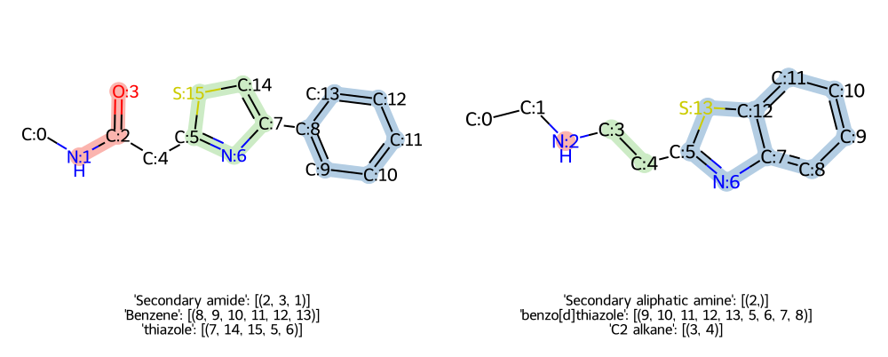

# AccFG

AccFG is a tool for Accurate Functional Group Extraction and Molecular Structure Comparison

## Features
* Extract functional groups from a molecule with **atom number**.
* Automatically build **hierarchical** functional groups.
* A **"Lite"** version for a concise list of functional groups.
* **Compare two molecules** at functional group level.
* Easy to **Customize FG list** and no complex SMARTS constraints.

## Quick start
### Installation
```
pip install accfg
```

### FG extraction
```python
from accfg import AccFG, print_fg_tree

afg = AccFG(print_load_info=True, lite=False)
smi = 'CN(C)/N=N/C1=C(NC=N1)C(=O)N'
fgs,fg_graph = afg.run(smi, show_atoms=True, show_graph=True)

print_fg_tree(fg_graph, fgs.keys(), show_atom_idx=True)
# ├──Primary amide: ((10, 12, 11),), ...

print(fgs)
# {'Primary amide': [(10, 12, 11)], 'Triazene': [(1, 3, 4)], 'imidazole': [(5, 9, 8, 7, 6)]}
```
### Molecule comparison
```python
from accfg import AccFG, compare_mols, draw_compare_mols

smi_1,smi_2 = ('CNC(=O)Cc1nc(-c2ccccc2)cs1','CCNCCc1nc2ccccc2s1')
diff = compare_mols(smi_1, smi_2)

print(diff)
# (([('Secondary amide', 1, [(2, 3, 1)]),

img = img_grid(draw_compare_mols(smi_1, smi_2),num_columns=2)
```



## Citation
If you find AccFG useful in your research or projects, please cite our paper:
```
@article{liu2025accfg,
  title={AccFG: Accurate Functional Group Extraction and Molecular Structure Comparison},
  author={Liu, Xuan and Swaminathan, Sarathkrishna and Zubarev, Dmitry and Ransom, Brandi and Park, Nathaniel and Schmidt, Kristin and Zhao, Huimin},
  journal={Journal of Chemical Information and Modeling},
  volume={65},
  number={16},
  pages={8593--8602},
  year={2025},
  publisher={American Chemical Society}
}
```
